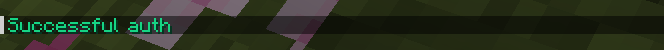
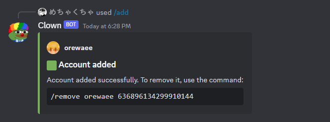

# DiscordAuth

DiscordAuth is a plugin that allows you to quickly and easily set up Discord auth for the Velocity proxy server.

## Installation
To set up DiscordAuth, there are several steps you need to follow.

First you need to configure the Velocity proxy server.
It must have at least two servers, one of which will be a lobby.
Its name must be specified in `config.toml`.

It is also important to specify the Discord bot token and user id in `config.toml`,
who will be able to use the commands of this very bot.

In general, these are all the necessary settings.
In addition to them, it is possible to customize messages or session expiration time.
A complete list of all configurable properties is in `config.toml`.

## Commands
The plugin is currently under development, therefore some commands may disappear.

Please report any incorrect commands in [`issues`](https://github.com/orewaee/DiscordAuth/issues).

#### Discord
- `/add <name> <discord id>` - adds a new account.
- `/remove <name> <discord id>` - removes an existing account.

#### Minecraft
- `/da reload` - reloads the plugin config.
- `/account add <discord id> <name>` - adds a new account.
- `/account remove <discord id> <name>` - removes an existing account.
- `/test` is a temporary command needed for debugging.

## Gallery

## TODO
- [ ] Fix version checking
- [ ] Fix other managers
- [ ] Separate config and messages
- [ ] Rewrite commands to brigadier command
